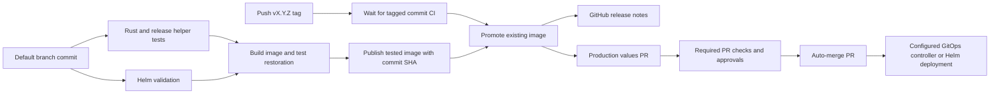

Push a stable version tag to promote the tested image and create a production Helm values pull request (PR).
After required checks and approvals pass, GitHub automatically merges the PR.
Configure the registry, release GitHub App, branch protection, and deployment environment below before releasing.

From the default-branch commit you want to release:

```sh
git tag v0.1.0
git push origin --tags
```

The commit must already be pushed to the default branch.
The workflow waits for that commit's CI run to succeed before promoting its image.
Both lightweight and annotated tags work. The local release helper and local AWS credentials are optional.



[ci.yaml](ci.yaml) runs Rust checks, release helper tests, and Helm validation on pull requests and pushes to `main` or `master`.
Helm validation covers the default values and both environment overlays.
After these checks pass, CI builds the container and runs [smoke.sh](../../smoke.sh), including shutdown and restoration.
Default-branch pushes upload that tested image as a temporary artifact and publish it with its full commit SHA.
The publishing job loads the artifact without rebuilding the image, following Docker's [image sharing pattern](https://docs.docker.com/build/ci/github-actions/share-image-jobs/).
Image publishing is disabled until `AWS_ACCOUNT_ID` is set. Pull requests never publish images.
Existing commit images are reused, and newer pushes do not cancel earlier commit builds.
The image targets `linux/amd64`.
Image artifacts expire after one day. If a publishing retry cannot download its artifact, rerun all CI jobs.

[release.yaml](release.yaml) accepts stable tags such as `v0.1.0` on commits reachable from the default branch.
[wait_for_ci.sh](../../bin/ci/wait_for_ci.sh) waits up to one hour for the exact commit's default-branch CI run.
Failed or cancelled CI stops the release. GitHub API errors also stop the release.
[retag_image.sh](../../bin/ci/retag_image.sh) copies the existing ECR manifest to the version tag.
The release keeps the original image digest. It performs no build or image download.
An existing version with the same digest succeeds; a different digest fails.
See the [ECR retagging reference](https://docs.aws.amazon.com/AmazonECR/latest/userguide/image-retag.html).

After promotion, separate jobs publish release notes and open a PR from `releases/<version>` to the current default branch.
The PR changes only `image.repository` and `image.tag` in [chart/values.prod.yaml](../../chart/values.prod.yaml).
The workflow uses signed Conventional Commits and preserves other production settings.
The release App creates the PR, which starts the usual PR checks automatically.
The workflow enables squash auto-merge for the generated PR and checks that its head commit still matches.
Required checks and approvals must pass before GitHub merges it.
Set `RELEASE_AUTO_MERGE` to `false` to review and merge release PRs manually.
Release notes and the values PR can be retried independently after successful promotion.

Configure these GitHub Actions repository variables:

| Variable | Required | Value or default |
| --- | --- | --- |
| `AWS_ACCOUNT_ID` | Yes | Your 12-digit AWS account ID |
| `AWS_REGION` | No | `us-west-2`, for the ECR registry |
| `ECR_REPOSITORY` | No | `sqlite-web-starter` |
| `AWS_ECR_ROLE_NAME` | No | `github-ecr-push` |
| `RELEASE_APP_ID` | Yes | ID of the GitHub App installed on this repository |
| `RELEASE_AUTO_MERGE` | No | Auto-merge is enabled unless this value is `false` |

For public repositories, use only infrastructure identifiers suitable for public disclosure.
The [release workflow](release.yaml) writes the ECR hostname and repository name into [chart/values.prod.yaml](../../chart/values.prod.yaml).
The hostname includes the AWS account ID; the release PR and image publishing logs expose these identifiers.
Keep internal or company deployment values in private configuration.

Create the ECR repository with immutable tags before enabling publishing.
Immutability prevents another publisher from replacing a release between the lookup and promotion.
Keep SHA tags until their releases are no longer needed.

Configure the role for GitHub OpenID Connect (OIDC), with audience `sts.amazonaws.com`.
Permit these subjects, replacing `OWNER`, `REPO`, and `DEFAULT_BRANCH`:

```text
repo:OWNER/REPO:ref:refs/heads/DEFAULT_BRANCH
repo:OWNER/REPO:ref:refs/tags/v*
```

Use `StringLike` for the tag subject wildcard.
The role needs `ecr:GetAuthorizationToken` on `*` and these actions on the target repository:

```text
ecr:BatchCheckLayerAvailability
ecr:BatchGetImage
ecr:CompleteLayerUpload
ecr:GetDownloadUrlForLayer
ecr:InitiateLayerUpload
ecr:PutImage
ecr:UploadLayerPart
```

See the [AWS credentials action's OIDC setup](https://github.com/aws-actions/configure-aws-credentials#oidc).
The workflows use short-lived AWS credentials; they need no stored AWS access keys.
The chart's `region` value controls Litestream object storage separately from the registry region.

Install a GitHub App on this repository with **Contents: Read and write** and **Pull requests: Read and write** permissions.
Store its App ID in the `RELEASE_APP_ID` repository variable.
Store its private key in the `RELEASE_APP_PRIVATE_KEY` Actions secret.
The workflow creates a short-lived installation token scoped to this repository.
See [GitHub App token setup](https://github.com/actions/create-github-app-token#usage).

The App token creates signed PR commits and triggers PR checks automatically.
The standard `GITHUB_TOKEN` creates the GitHub release and reads the source commit's CI status.
See the [create-pull-request token guidance](https://github.com/peter-evans/create-pull-request/blob/v7/docs/concepts-guidelines.md#triggering-further-workflow-runs).

Under repository **Settings → General → Pull Requests**, enable **Allow squash merging** and **Allow auto-merge**.
Protect the default branch with the required CI checks: `checks`, `Validate Helm chart`, and `Test container lifecycle`.
Require any human approvals that your deployment process needs.
Keep the release App subject to these requirements.
Auto-merge waits only for requirements configured in branch protection or rulesets; unrequired checks do not block merging.
See [GitHub auto-merge setup](https://docs.github.com/en/repositories/configuring-branches-and-merges-in-your-repository/configuring-pull-request-merges/managing-auto-merge-for-pull-requests-in-your-repository).

To release:

1. Merge the application changes into the default branch.
2. Update your local default branch to the commit you want to release.
3. Create and push the version tag with the two commands above.
4. Review the generated PR and provide any required approval.

CI completion, image promotion, PR checks, and auto-merge run in GitHub Actions and GitHub.
If `RELEASE_AUTO_MERGE` is `false`, merge the PR manually after its checks pass.

The [release helper](../../bin/release.sh) requires Bash, Git, GNU `sort`, AWS CLI, and jq.
Authenticate AWS CLI to the account used by CI, with permission to read the ECR repository.
Set `AWS_REGION` and `ECR_REPOSITORY` if CI uses values other than the defaults listed above.
The helper uses your local AWS credentials; it does not assume the GitHub OIDC role.

For optional local validation, wait for **Publish commit image** to succeed.
Preview the release for the exact commit:

```sh
just release v0.1.0 COMMIT_SHA
```

The preview refreshes the origin default branch and checks that the commit belongs to its history.
It checks local and remote tags, requires a newer stable version, and verifies the SHA image in ECR.
The first release needs no existing tags. Preview creates no release tag.

Create and push the validated tag:

```sh
just release v0.1.0 COMMIT_SHA --execute
```

You can also invoke `bash bin/release.sh VERSION COMMIT [--execute]` directly.
Bare versions such as `0.1.0` are normalized to `v0.1.0`.
Execution creates an annotated tag on the selected commit and pushes only that tag.
If the push fails, the local tag remains. Inspect the remote before retrying or removing that local tag.

If the CI wait fails, fix or rerun CI for that commit, then rerun the failed release jobs.
If promotion reports a missing SHA image, check the AWS publishing variables and the commit's **Publish commit image** job.
After correcting publishing, rerun CI for that commit and rerun the failed release jobs.
If PR creation fails, check the release App installation, permissions, variable, and secret, then rerun the values PR job.
If auto-merge fails, enable the repository merge settings above, then rerun the values PR job.
Do not move an existing release tag to another commit. Use a new version for changed application code.
Only `vX.Y.Z` tags are supported; service prefixes and prerelease suffixes are not supported.

Connect your production GitOps controller to the default branch, chart path `chart`, and values file `values.prod.yaml`.
With automatic synchronization enabled, merging the PR selects the image for deployment.
The repository does not configure a cluster or GitOps application. Without a controller, apply the merged values yourself:

```sh
helm upgrade --install sqlite-web-starter ./chart --namespace prod -f ./chart/values.prod.yaml
kubectl --namespace prod rollout status statefulset/sqlite-web-starter
```

Configure the namespace, replica Secret, workload identity, and internal ingress described in [operations](../../docs/operations.md) before running these commands.
The initial `unreleased` image tag is a placeholder; deploy only after the first release PR fills the image fields.
