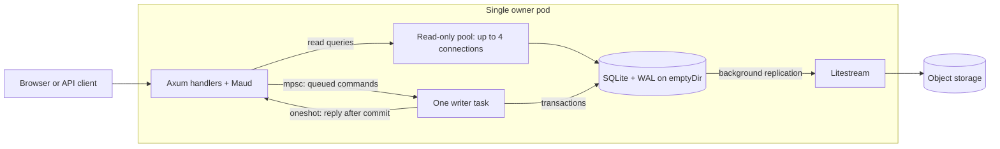

**sqlite-web-starter** provides one SQLite writer, concurrent readers, and Litestream backups.

This foundational Rust example uses ephemeral pod storage with a durable replica in object storage.
Litestream restores SQLite when a replacement pod starts, so the chart needs no persistent volume or PersistentVolumeClaim (PVC).
One StatefulSet replica owns the database. Staging and production examples include internal HTTP routing for the HTML page.

Axum and Maud serve a counter and inventory backed by SQLite.
For normal counter requests, HTTP handlers use a cloneable `Database` handle; only the writer owns a writable connection.



**Each write uses two channels:**

1. `Database::increment()` creates a fresh `oneshot` channel for that request's reply.
2. `try_send` puts the command and reply sender into the shared `mpsc` queue. The handler awaits its reply.
3. The writer receives commands one at a time, runs each transaction, and commits it.
4. The writer sends the committed value through `oneshot`. The handler returns JSON or redirects the browser.

The shared `mpsc` queue lets many handlers feed one writer, serializing writes. Each `oneshot` returns one request's result to its caller.

Reads bypass the channels through a SQLx pool with `read_only` and `query_only` enabled.
Write-ahead log (WAL) mode allows reads alongside writes to the same database.

The queue holds 64 pending commands; full or closed queues return HTTP 503.
Accepted writes still run if callers disconnect. A missing reply means an unknown outcome; blind retries can duplicate writes.

**In the container**, startup restores a missing database, applies migrations, and confirms an initial replica sync before serving HTTP.
Litestream runs as the parent process and replicates in the background.
Normal shutdown drains HTTP handlers, closes and drains the write queue, then closes SQLite.
After Rust exits successfully, Litestream attempts its final sync. Replacement pods restore onto fresh local storage.

A successful write confirms a local commit; remote replication follows asynchronously.

**Abrupt failures can still lose unreplicated writes.**

Keep one live owner per replica prefix. The chart does not fence a disconnected old owner.

Run locally with Rust 1.97.1 selected by [rust-toolchain.toml](rust-toolchain.toml):

```sh
cargo run --locked
```

Open <http://localhost:3000/>. Local mode stores `./data/demo.sqlite` and runs without Litestream.
`GET` and `POST /counter` expose the counter as JSON; `/ready` checks application readiness, writer availability, and a database read.
`/healthy` reports HTTP server liveness without accessing SQLite. The chart uses `/ready` for startup and readiness probes, and `/healthy` for liveness.

**See why the write queue helps.**

Run the contention lab on the homepage, or request its JSON results:

```sh
curl -sS -X POST http://localhost:3000/contention
```

Each round releases 12 concurrent server-side calls against a fresh, temporary WAL database.
Each successful transaction holds its write lock for 75 milliseconds before committing.
Both rounds disable SQLite's busy timeout to expose contention immediately.

| Round | Write path | Expected result |
| --- | --- | --- |
| Direct | 12 independently opened writable connections | Overlapping writes fail with `SQLITE_BUSY`; exact counts depend on scheduling |
| Queued | The existing `Database::increment()` channel and writer | All 12 writes commit, returning values 1 through 12 |

The results show each call's outcome, elapsed time, and committed value, plus each round's final counter value.
Call timings include queue wait. The deliberate delay makes this a contention demonstration, not a throughput benchmark.
Busy failures are real lock conflicts; the atomic increment does not silently lose updates.

SQLite already permits only one writer at a time, including in WAL mode.
Adding writable connections cannot create simultaneous SQLite writers. See [SQLite WAL concurrency](https://www.sqlite.org/wal.html#concurrency).
The channel is one coordination choice: a mutex, or suitable busy timeouts and retries, can also handle competing callers.
See [SQLite busy timeout behavior](https://www.sqlite.org/c3ref/busy_timeout.html).
Here, the bounded channel also provides explicit admission, one connection owner, and a reply after each commit.

The lab leaves the saved counter and its replica unchanged. Normal counter writes retain their five-second busy timeout and have no deliberate delay.
Only one lab experiment runs per server at a time; overlapping requests return HTTP 429.

Each [dashboard component](src/dashboard/components/) has its own folder with `mod.rs` and its JavaScript or CSS files.
Shared page styles live in [styles.css](src/dashboard/styles.css).
[build.rs](build.rs) discovers these assets recursively and minifies them during Cargo builds. The executable embeds and serves only the minified bundles through content-hashed URLs.
Maud references those URLs; Axum serves the files with cache headers. Adding or editing a sibling asset triggers a rebuild without a central asset list.
JavaScript updates the counter without reloading the page. With JavaScript disabled, the form submits normally and redirects after the write.
The build requires no Node.js, npm, or separate frontend command.

```sh
just test       # Rust unit and integration tests
just smoke      # Build the image and verify writes, shutdown, and restoration
just local-ci   # All source, release-helper, Helm, and container checks
```

The [integration suite](tests/README.md) groups HTTP tests under `tests/api/`, with a shared helper for temporary databases and application requests.
It imports the application's public library API from [lib.rs](src/lib.rs). The executable delegates to the same library.
Unit tests stay beside their implementation in `src/`. Private lifecycle checks live inline in [startup.rs](src/startup.rs).

```text
tests/
  README.md
  api/
    main.rs
    helpers.rs
    health_check.rs
    counter.rs
    page.rs
```

| Read next | What it owns |
| --- | --- |
| [database.rs](src/database.rs) | Read pool, command queue, transactions, replies, and writer drain |
| [contention.rs](src/database/contention.rs) | Temporary databases and concurrent calls for the contention lab |
| [startup.rs](src/startup.rs) | Application construction, task supervision, and shutdown ordering |
| [tests/README.md](tests/README.md), [tests/api/](tests/api/) | API integration test conventions and HTTP cases |
| [replication.rs](src/replication.rs) | Initial Litestream sync before HTTP starts |
| [routes.rs](src/routes.rs) | HTTP endpoints and error mapping |
| [pages.rs](src/dashboard/pages.rs), [layouts.rs](src/dashboard/layouts.rs) | Maud page composition and the shared HTML shell |
| [components/](src/dashboard/components/), [styles.css](src/dashboard/styles.css) | Individual component folders with Rust and browser assets, plus shared page styles |
| [build.rs](build.rs), [assets.rs](src/dashboard/assets.rs) | Discover, minify, embed, and serve CSS and JavaScript |
| [migrations/](migrations/) | Schema and initial inventory |

See [operations](docs/operations.md) for configuration, Kubernetes, and durability limits;
see [build and release setup](.github/workflows/README.md) for CI and version tags,
and [engineering quality](docs/quality.md) for code and review conventions.

After configuring [release automation](.github/workflows/README.md), release a pushed default-branch commit with:

```sh
git tag v0.1.0
git push origin --tags
```

The workflow waits for CI, promotes the tested image, and opens a production values PR.
GitHub merges the PR after required checks and approvals pass.
Set the repository variable `RELEASE_AUTO_MERGE=false` to merge releases manually.
